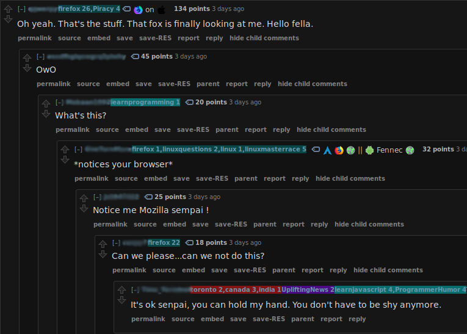
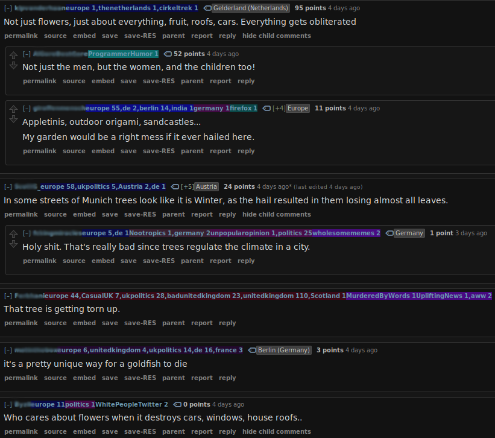

# Prerequisites

## Server

Relies on `rscraper-tagger` that is built in this project. See [root instructions](..) for details on installing or building that.

Aside from that, it just needs a server to run on, and that server must support C imports. In the examples you can find both a [Python flask server](server.py) and a [Go server](src/rtagger.go)

## Browser Addons

    * GreaseMonkey or similar

# Installation

Install the [Javascript script](rtagger.js) into greasemonkey.

# Usage

Your chosen must be running (on the port specified in [Javascript script](rtagger.js)) in order for the Javascript script to add tags to users.
